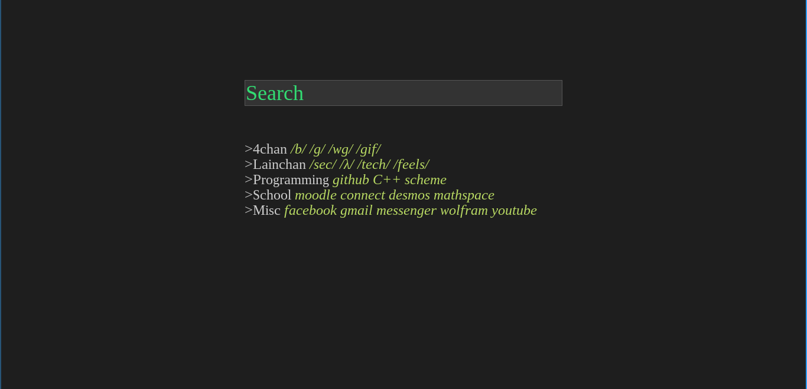

# minimal-start
A minimalistic startpage written purely in html and css

#For those without html/css experience
Inside of 
 and 
 start each line of links with a category, then add the links and end the line with   like this 
category name
	<a href="link address">link label</a>
	<a href="link address2">link label2</a>
 
